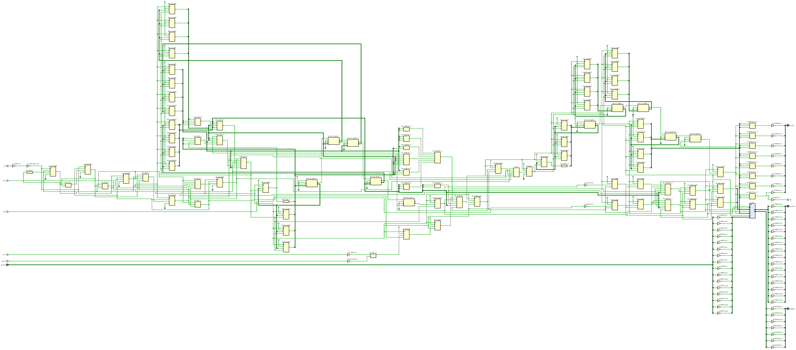
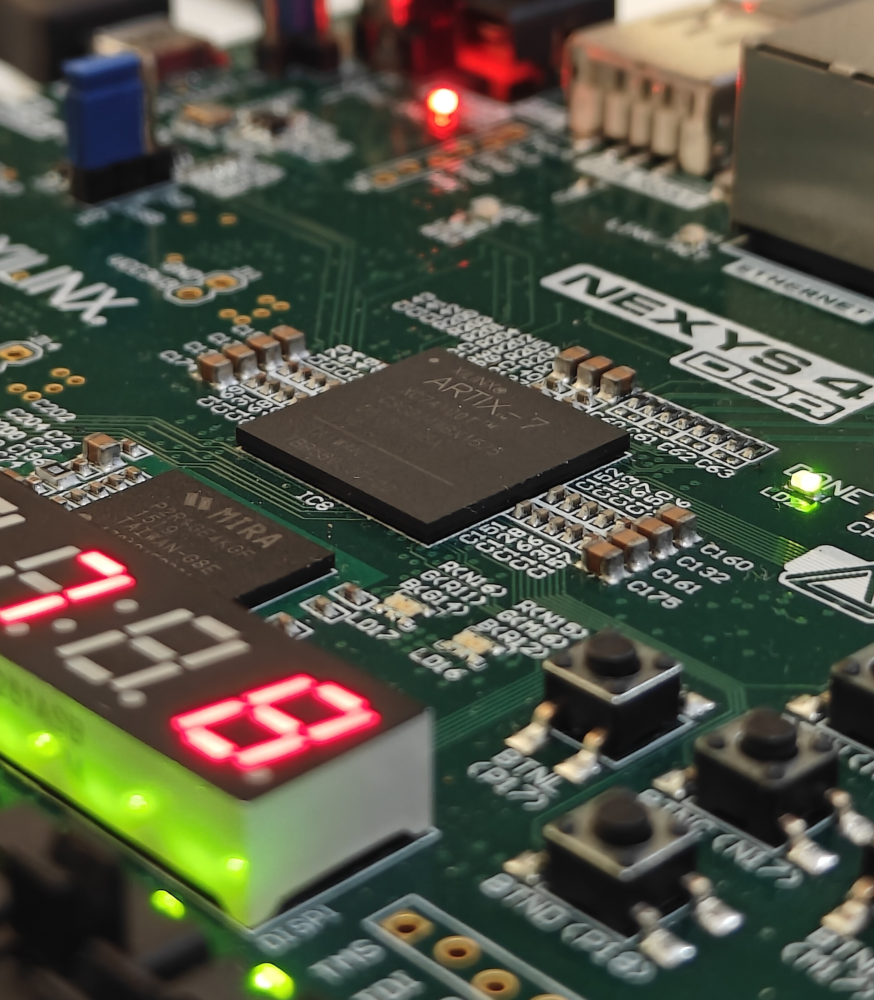

# 2×2 Systolic Array Matrix Multiplier — Nexys 4 DDR FPGA

FPGA implementation of a 2×2 systolic array matrix multiplier targeting the Digilent Nexys 4 DDR board (Xilinx Artix-7 XC7A100T). The design is described in synthesizable Verilog HDL and computes C = A × B for 2-bit integer matrices in exactly five manually-clocked pipeline steps. Results are displayed in real-time on the board's 16 user LEDs and 8-digit seven-segment display.

---

## Table of Contents

- [Overview](#overview)
- [Architecture](#architecture)
- [Input Staggering](#input-staggering)
- [Pipeline Walk-through](#pipeline-walk-through)
- [Repository Structure](#repository-structure)
- [Hardware Requirements](#hardware-requirements)
- [Building and Programming](#building-and-programming)
- [Usage](#usage)
- [Resource Utilisation](#resource-utilisation)
- [Results](#results)
- [Relevance to AI Accelerators](#relevance-to-ai-accelerators)
- [References](#references)

---

## Overview

Matrix multiplication is the dominant compute kernel in convolutional neural networks, transformer attention, and signal processing. The systolic array, proposed by Kung and Leiserson (1978), addresses memory-bandwidth bottlenecks by routing operands rhythmically through a mesh of tightly coupled processing elements (PEs). Each PE performs a multiply-accumulate (MAC) operation and forwards its operands to its neighbors — no global memory bus between PEs is required.

This project implements a minimal but complete instance of that architecture at a scale that can be verified step-by-step by hand on real hardware.

Key inspiration: [https://deep-learning00.tistory.com/27](https://deep-learning00.tistory.com/27)

---

## Architecture

Four PEs are arranged in a 2×2 mesh. Row elements of A enter from the left and propagate rightward; column elements of B enter from the top and propagate downward. Each PE accumulates `a_in × b_in` and forwards both operands to its right and bottom neighbors on the same clock edge.
```
         b11        0
          |          |
a11 --> [PE(0,0)] --> [PE(0,1)]
          |          |
 0  --> [PE(1,0)] --> [PE(1,1)]
```


### Processing Element (`pe.v`)

Each PE is a registered MAC unit with explicit clock-enable, reset, and load-clear control:
```
acc = a_in × b_in          if clear = 1  (load-clear)
acc = acc + a_in × b_in    if clear = 0  (accumulate)
```

Parameters:
- Inputs: `a_in[1:0]`, `b_in[1:0]` — 2-bit operands (values 0–3)
- Accumulator: `acc[4:0]` — 5-bit (max value = 3×3 + 3×3 = 18)
- `a_out` forwards `a_in` rightward; `b_out` forwards `b_in` downward
- All state transitions gated by `clk_en` — one button press = one pipeline step

### Controller (`systolic_2x2.v`)

A five-state FSM (IDLE → CY1 → CY2 → CY3 → FLUSH) orchestrates input staggering and drives the four PEs. Separate feed registers (`feed_a0`, `feed_a1`, `feed_b0`, `feed_b1`) schedule each row/column lane.

### Top-Level Board Integration (`top_nexys4.v`)

- **Power-on reset**: 6-bit counter holds `rst=1` for 20 cycles at startup
- **Button debouncing**: Two-FF synchroniser + 1 ms sampling window (100,000 cycles at 100 MHz) + rising-edge detector for BTNC (clock), BTNL (start), BTNR (reset)
- **Switch mapping**: 16 slide switches provide eight 2-bit matrix elements, LSB-first per pair
```
  SW[1:0]=a00  SW[3:2]=a01  SW[5:4]=a10  SW[7:6]=a11
  SW[9:8]=b00  SW[11:10]=b01  SW[13:12]=b10  SW[15:14]=b11
```

- **LED display**: All 16 LEDs show the four 5-bit accumulators in 4-bit saturating representation
- **7-segment display**: 8-digit multiplexed display (≈764 Hz refresh) shows exact decimal values 0–18 for all four result elements with leading-zero blanking

---

## Input Staggering

Input staggering is the critical enabling mechanism. Because operands propagate through PEs with a one-cycle latency per hop, inputs must be time-skewed so the correct `a_ij` and `b_ij` arrive at each PE simultaneously.

For PE(r, c), data arrives r + c cycles after PE(0,0) receives its first input:

| Feed lane     | Delay   |
|---------------|---------|
| Row 0 of A    | 0 cycles |
| Row 1 of A    | 1 cycle  |
| Col 0 of B    | 0 cycles |
| Col 1 of B    | 1 cycle  |

Without staggering, PE(1,1) — two hops from both feeds — would receive `a00` and `b00` instead of `a10` and `b01`, producing a completely wrong result.

---

## Pipeline Walk-through

| Press | State | PE(0,0)              | PE(0,1)              | PE(1,0)              | PE(1,1)              |
|-------|-------|----------------------|----------------------|----------------------|----------------------|
| 1     | IDLE  | 0                    | 0                    | 0                    | 0                    |
| 2     | CY1   | a00×b00 (clear)      | 0×0 (clear)          | 0×0 (clear)          | 0×0 (clear)          |
| 3     | CY2   | += a01×b10 ✓         | += a00×b01           | += a10×b00           | += 0×0               |
| 4     | CY3   | += 0×0               | += a01×b11 ✓         | += a11×b10 ✓         | += a10×b01           |
| 5     | FLUSH | —                    | —                    | —                    | += a11×b11 ✓         |

✓ = PE accumulator reaches its final value for that C_ij element.


---

## Building and Programming

**1. Clone the repository**
```bash
git clone https://github.com/<your-username>/nexys4-systolic-array.git
cd nexys4-systolic-array
```

**2. Open project in Vivado**

Launch Vivado, create a new RTL project targeting `xc7a100tcsg324-1`, and add all files from `rtl/` and `constraints/`.

Alternatively, source the provided Tcl script if included:
```tcl
source scripts/create_project.tcl
```

**3. Run synthesis and implementation**

In Vivado:
```
Flow Navigator → Run Synthesis → Run Implementation → Generate Bitstream
```

**4. Program the board**

Connect the Nexys 4 DDR via USB-JTAG, open Hardware Manager, and program the generated `.bit` file.


---

## Usage

1. Set the 16 slide switches to encode your two 2×2 matrices (2 bits per element, LSB-first):
   - `SW[1:0]` = a00, `SW[3:2]` = a01, `SW[5:4]` = a10, `SW[7:6]` = a11
   - `SW[9:8]` = b00, `SW[11:10]` = b01, `SW[13:12]` = b10, `SW[15:14]` = b11

2. Press **BTNL** to load inputs and arm the array.

3. Press **BTNC** four times to step through the pipeline (CY1 → CY2 → CY3 → FLUSH).

4. Read the four result elements from the 7-segment display (two digits per element) or the LED array.

5. Press **BTNR** at any time to reset.

---

## Resource Utilisation

Synthesised and implemented on XC7A100T-1CSG324C with Vivado. Multiplications are implemented entirely in LUT fabric — 2-bit operand products do not justify DSP48 instantiation.

| Resource   | Used | Available | Utilisation |
|------------|------|-----------|-------------|
| Slice LUTs | 97   | 63,400    | 0.15%       |
| Flip-Flops | 95   | 126,800   | 0.07%       |
| DSPs       | 0    | 240       | 0%          |
| BRAM       | 0    | 135       | 0%          |

**Timing (Post-Implementation)**

| Parameter              | Value    |
|------------------------|----------|
| Clock frequency        | 100 MHz  |
| Worst-case setup slack | 5.358 ns |
| Worst-case hold slack  | 0.124 ns |

---

## Results

Test case: A = B = [[2, 1], [1, 2]]. Expected result: C = [[5, 4], [4, 5]].

| Press | State | acc00 | acc01 | acc10 | acc11 |
|-------|-------|-------|-------|-------|-------|
| 1     | IDLE  | 0     | 0     | 0     | 0     |
| 2     | CY1   | 4     | 0     | 0     | 0     |
| 3     | CY2   | 5     | 2     | 2     | 0     |
| 4     | CY3   | 5     | 4     | 4     | 1     |
| 5     | FLUSH | 5     | 4     | 4     | 5     |

After press 5, the 7-segment display shows `05 04 04 05`, confirming C = [[5, 4], [4, 5]].

### Vivado Schematic



### Hardware



---

## Relevance to AI Accelerators

The systolic array is the compute primitive underlying virtually every modern deep-learning accelerator:

- **Google TPU**: 256×256 systolic array of bfloat16 MAC units; TPUv4 delivers over 275 TOPS per chip.
- **NVIDIA Tensor Cores**: Implement a 4×4×4 or 16×16×16 matrix fragment operation using systolic dataflow within a single warp instruction (WMMA). Each Ampere SM contains 256 Tensor Core FP16 MACs, enabling 312 TFLOPS on the A100 SXM.
- **Intel Gaudi / Eyeriss**: Adopt the same localised dataflow principle at varying scales.

The properties that make the systolic architecture efficient at any scale are the same ones demonstrated in this 4-PE implementation: high compute-to-memory ratio, deterministic latency, linear throughput scaling, and energy-efficient short-distance operand forwarding.

---

## References

1. H. T. Kung and C. E. Leiserson, "Systolic arrays (for VLSI)," *Sparse Matrix Proceedings 1978*, SIAM, 1979.
2. N. P. Jouppi et al., "In-datacenter performance analysis of a tensor processing unit," *Proc. ISCA*, 2017.
3. S. Markidis et al., "NVIDIA Tensor Core programmability, performance & precision," *Proc. IPDPSW*, 2018.
4. Y.-H. Chen et al., "Eyeriss: An energy-efficient reconfigurable accelerator for deep CNNs," *IEEE J. Solid-State Circuits*, vol. 52, no. 1, 2017.
5. H. T. Kung, "Why systolic architectures?" *IEEE Computer*, vol. 15, no. 1, 1982.
6. Digilent Inc., [Nexys 4 DDR Reference Manual](https://reference.digilentinc.com/reference/programmable-logic/nexys-4-ddr/reference-manual), 2016.
7. Key inspiration: [https://deep-learning00.tistory.com/27](https://deep-learning00.tistory.com/27)

---

## Author

Roshan Tripathy  
School of Electronics Engineering  
Kalinga Institute of Industrial Technology (KIIT), Deemed to be University  
Bhubaneswar, India

---

## License

This project is released for educational and research use. See [LICENSE](LICENSE) for details.
